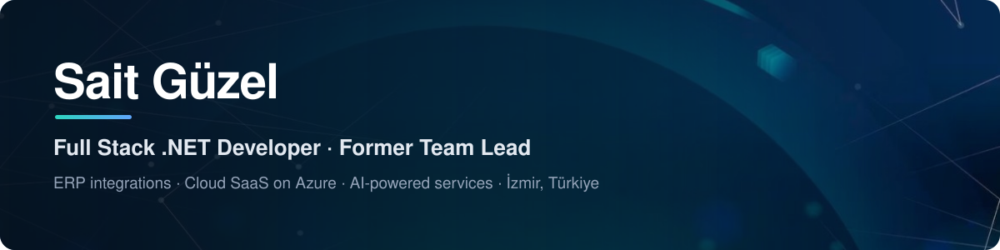
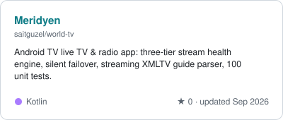
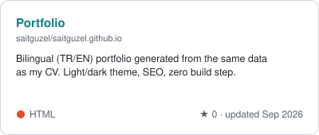
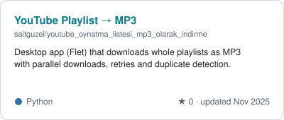
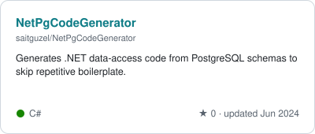
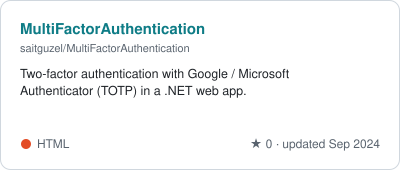
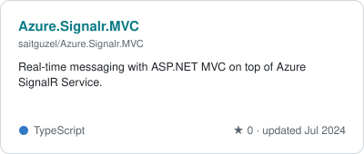
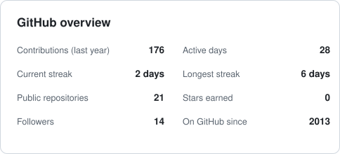
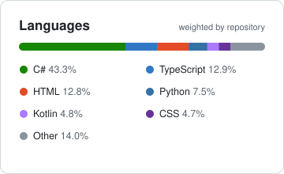
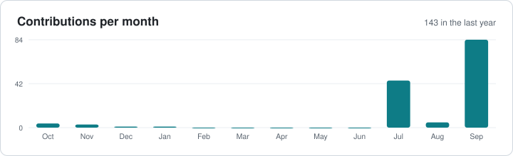

  

  
  
  
  

  <a href="https://saitguzel.github.io/en/"><b>Portfolio</b></a> ·
  <a href="https://saitguzel.github.io/cv/sait-guzel-cv-2026-en.pdf"><b>CV (PDF)</b></a> ·
  <a href="STATS.md"><b>Detailed GitHub statistics</b></a> ·
  <a href="#-türkçe"><b>Türkçe</b></a>

## 👋 About me

I'm **Sait**, a full stack developer from İzmir, Türkiye, building end-to-end products on the **.NET ecosystem since 2015**. Over the years I have worked across **logistics, education, manufacturing, healthcare, fintech and media**: from ERP integrations and microservice architectures to enterprise SaaS platforms on Azure, ETL/reporting pipelines and AI-powered services.

I spent **four years as Software Development Team Lead** at Monovi, leading a 5–8 person team's technical direction, architecture decisions and delivery. What I enjoy most is rewriting legacy systems with modern stacks and turning complex business rules into simple, scalable software.

- 🔭 **Now:** Software Specialist at **Code35** (remote), building a middleware API on top of the **Netsis ERP** database, a real-time unit cost model and LLM-based document automation.
- 🎙️ **Recently:** backend and AI services for a karaoke platform at **Mergenova**: .NET 9 microservices, a trained **Whisper** model for timestamped lyrics, pitch analysis and **Claude API** feedback.
- 🌱 **Side projects:** .NET 10, Flutter, Rust and Kotlin products (see below), and vision-LLM pipelines with human-in-the-loop validation.
- 📚 **Learning:** agentic AI architectures, Databricks, advanced PostgreSQL.
- 💬 **Ask me about:** .NET & Azure architecture, ERP integrations, PostgreSQL, turning a messy process into software.

## 🧰 Tech stack

| | |
|---|---|
| **Languages** |         |
| **Backend** |       |
| **Frontend & Mobile** |       |
| **Data** |       |
| **Cloud & DevOps** |       |
| **AI** |     |

## ⭐ Featured public projects

<table>
<tr><td></td><td></td></tr>
<tr><td></td><td></td></tr>
<tr><td></td><td></td></tr>
</table>

## 🔒 Private work & products

Some of my most substantial work lives in private repositories. Highlights:

| Project | What it is | Stack |
|---|---|---|
| **Yerel Yemcim** | Turns cooperatives' paper price lists into structured data from a photo; vision-LLM output passes 8 deterministic validators and mandatory human approval. In pilot use. | .NET 10, EF Core, PostgreSQL, Flutter, Qwen VL, Docker |
| **Local LMS** | Self-hosted, privacy-by-design modular LMS & HR platform with 13 modules; web, desktop and mobile clients from one React codebase. | .NET 10, React, Tauri v2, PostgreSQL, MinIO, Playwright |
| **PlayZone Hub** | Multi-tenant SaaS for playgrounds and kids' activity centers: 9 microservices behind a YARP gateway. | .NET 10, RabbitMQ, Redis, SignalR, React, Flutter |
| **EnterpriseForge CodeGen** | ABP Suite-style code generator producing Rust backends, Angular front-ends and Flutter apps from entity definitions. | Rust, Actix Web, SQLx, Angular, Flutter |
| **Netsis ERP middleware** · Code35 | Middleware API over the ERP database, real-time unit cost model, LLM document automation (invoices, bank statements). | Node.js, SQL Server, PostgreSQL, n8n, Docker |
| **TonTon** · Mergenova | Karaoke platform backend: microservices, timestamped lyrics with a trained Whisper model, pitch analysis, LLM feedback. | .NET 9, FastAPI, PostgreSQL, MongoDB, Neo4j, RabbitMQ |
| **monligo.com** · Monovi | Enterprise application platform with social sign-in and multilingual content. | .NET 8, Azure App Service, Key Vault, PostgreSQL, Azure AI |
| **emlaklira.com** · Monovi | Real-estate tokenization and trading platform. | .NET 6, Solidity, Azure SQL Ledger, APIM, Functions |
| **Monovi Trace & ICS2** · Monovi | EU ICS2-compliant data submission for logistics companies. | .NET 6, SQL Server, EF Core |
| **okulsis.net** · Bilsa | Modular school management system with PHP API, Cordova mobile app and Selenium test automation. | ASP.NET, .NET Core, SQL Server, SignalR |

## 💼 Experience

| Period | Role | Company |
|---|---|---|
| Aug 2026 – present | Software Specialist (remote) | Code35 |
| Sep 2025 – Jun 2026 | Software Specialist | Mergenova Yazılım |
| Aug 2021 – Jul 2025 | **Software Development Team Lead** | Monovi Information Technology |
| Mar 2021 – Aug 2021 | Software Specialist | Monovi Information Technology |
| 2016 – 2021 | Software Developer | Bilsa Yazılım |
| Dec 2015 – Jun 2016 | Software Developer | Çağdaş Eczacılık Bilgi İşlem |

🎓 B.Sc. Computer Engineering, Pamukkale University (2010 – 2015)

## 📊 GitHub stats

  
  

➡️ **[See the detailed statistics page](STATS.md)**: contribution calendar, streaks, language breakdown and every public repository.

<b>🏅 Certifications (17)</b>

- Advanced PostgreSQL · Developing CI/CD Solutions with Azure DevOps · Agentic AI Fundamentals (LinkedIn Learning, 2025)
- Complete Guide to Databricks for Data Engineering · Microsoft Azure Synapse for Developers (LinkedIn Learning, 2025)
- Azure Key Vault for Developers · Azure Front Door · Power BI Essential Training (LinkedIn Learning, 2025)
- Building an Enterprise API for Advanced Azure Developers · ASP.NET Core Advanced Security: Data Protection
- Azure Data Lake for Developers · Kubernetes: Essential Tools (LinkedIn Learning)
- ASP.NET Core + Docker (Udemy) · SQL Server In Depth · Database Attacks and Security (BTK Akademi)
- CCNA R&S: Introduction to Networks · Routing and Switching Essentials (Cisco)

## 🇹🇷 Türkçe

<b>Kısaca ben</b>

İzmirliyim; **2015'ten bu yana .NET ekosisteminde** uçtan uca ürün geliştiriyorum. Lojistik, eğitim, üretim, sağlık, fintech ve medya sektörlerinde ERP entegrasyonlarından mikroservis mimarilerine, Azure üzerindeki kurumsal SaaS ürünlerinden yapay zekâ destekli servislere kadar pek çok projede sorumluluk aldım. **Monovi'de 4 yıl yazılım geliştirme takım liderliği** yaptım.

Şu anda **Code35**'te uzaktan çalışıyor; Netsis ERP üzerine ara katman API, anlık birim maliyet modeli ve LLM ile belge otomasyonu geliştiriyorum. Kişisel projelerimde .NET 10, Flutter, Rust ve Kotlin kullanıyorum.

🌐 Türkçe portfolyo: **[saitguzel.github.io](https://saitguzel.github.io)**

## ☕ Support

If my open-source work saved you some time, you can support me here:

---

Stats and cards are generated from public GitHub data by <a href="scripts/build_profile.py">scripts/build_profile.py</a> and refreshed daily by GitHub Actions. Last update: 22 Sep 2026.
