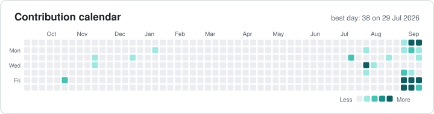

# 📊 GitHub statistics · Sait GÜZEL

[← Back to profile](README.md) · Last update: **18 Sep 2026** · Data: public GitHub API and contribution calendar

 

## Last 12 months

| Metric | Value |
|---|---|
| Total contributions | **152** |
| Active days | 25 |
| Current streak | 1 days |
| Longest streak | 6 days |
| Best day | 38 contributions on 29 July 2026 |
| Public repositories (own, non-fork) | 18 |
| Stars earned | 0 |
| Followers / following | 14 / 146 |
| Public gists | 18 |
| On GitHub since | 2013-10-21 |

> Contribution counts include private work only when "private contributions" is enabled on the profile.

<b>Contributions by month</b>

| Month | Contributions |
|---|---|
| September 2026 | 93 |
| August 2026 | 5 |
| July 2026 | 45 |
| June 2026 | 0 |
| May 2026 | 0 |
| April 2026 | 0 |
| March 2026 | 0 |
| February 2026 | 0 |
| January 2026 | 1 |
| December 2025 | 1 |
| November 2025 | 3 |
| October 2025 | 4 |

## Languages

Share of code across my own public repositories. Every repository has equal weight, so one large repo cannot dominate the chart.

| Language | Share | |
|---|---|---|
| C# | 49.7% | ████████████ |
| HTML | 14.9% | ████ |
| TypeScript | 13.9% | ███ |
| Kotlin | 5.6% | █ |
| Python | 5.6% | █ |
| CSS | 5.3% | █ |
| ASP | 3.0% | █ |
| JavaScript | 1.0% | █ |
| SCSS | 0.6% | █ |
| Dockerfile | 0.3% | █ |

## Public repositories

| Repository | Description | Language | ★ | Forks | Last push |
|---|---|---|---|---|---|
| [saitguzel.github.io](https://github.com/saitguzel/saitguzel.github.io) | Bilingual (TR/EN) portfolio generated from the same data as my CV. Light/dark theme, SEO, zero build step. | HTML | 0 | 0 | 2026-09-13 |
| [world-tv](https://github.com/saitguzel/world-tv) | Android TV live TV & radio app: three-tier stream health engine, silent failover, streaming XMLTV guide parser, 100 unit tests. | Kotlin | 0 | 0 | 2026-09-03 |
| [youtube_oynatma_listesi_mp3_olarak_indirme](https://github.com/saitguzel/youtube_oynatma_listesi_mp3_olarak_indirme) | Desktop app (Flet) that downloads whole playlists as MP3 with parallel downloads, retries and duplicate detection. | Python | 0 | 0 | 2025-11-19 |
| [TimeZoneManagementApp](https://github.com/saitguzel/TimeZoneManagementApp) | time zone management with api with reflection | C# | 0 | 0 | 2024-09-30 |
| [MultiFactorAuthentication](https://github.com/saitguzel/MultiFactorAuthentication) | Two-factor authentication with Google / Microsoft Authenticator (TOTP) in a .NET web app. | HTML | 0 | 0 | 2024-09-24 |
| [Azure.Signalr.MVC](https://github.com/saitguzel/Azure.Signalr.MVC) | Real-time messaging with ASP.NET MVC on top of Azure SignalR Service. | TypeScript | 0 | 0 | 2024-07-04 |
| [Signalr.Demo.App](https://github.com/saitguzel/Signalr.Demo.App) |  | TypeScript | 0 | 0 | 2024-07-01 |
| [loginwiththirdparty](https://github.com/saitguzel/loginwiththirdparty) | .net login with third party apps | C# | 0 | 0 | 2024-06-05 |
| [NetPgCodeGenerator](https://github.com/saitguzel/NetPgCodeGenerator) | Generates .NET data-access code from PostgreSQL schemas to skip repetitive boilerplate. | C# | 0 | 0 | 2024-06-05 |
| [HangfireTest](https://github.com/saitguzel/HangfireTest) | .net api hangfire test | C# | 0 | 0 | 2024-06-05 |
| [Ex_Files_Enterprise_Api](https://github.com/saitguzel/Ex_Files_Enterprise_Api) |  | TypeScript | 0 | 0 | 2023-10-05 |
| [BaseApi](https://github.com/saitguzel/BaseApi) | Base .Net 7 api project without EF Core | C# | 0 | 0 | 2022-11-09 |
| [DotNetCoreApiVueJS](https://github.com/saitguzel/DotNetCoreApiVueJS) |  | C# | 0 | 0 | 2022-07-16 |
| [DotNetCoreApiSQLite](https://github.com/saitguzel/DotNetCoreApiSQLite) |  | C# | 0 | 0 | 2022-07-16 |
| [PortalApi](https://github.com/saitguzel/PortalApi) | .net core portal api demo app | C# | 0 | 0 | 2021-04-25 |
| [NetCoreLocalizationGlobalization](https://github.com/saitguzel/NetCoreLocalizationGlobalization) | .Net Core MVC localization and globalization example | C# | 0 | 0 | 2020-12-12 |
| [NetCoreDapperAndEFCore](https://github.com/saitguzel/NetCoreDapperAndEFCore) | .Net Core MVC dapper and ef core simple example  | C# | 0 | 0 | 2020-12-12 |
| [Jquery-modalBox](https://github.com/saitguzel/Jquery-modalBox) | jquery-ajax-asp.net modalbox | ASP | 0 | 0 | 2015-02-05 |
